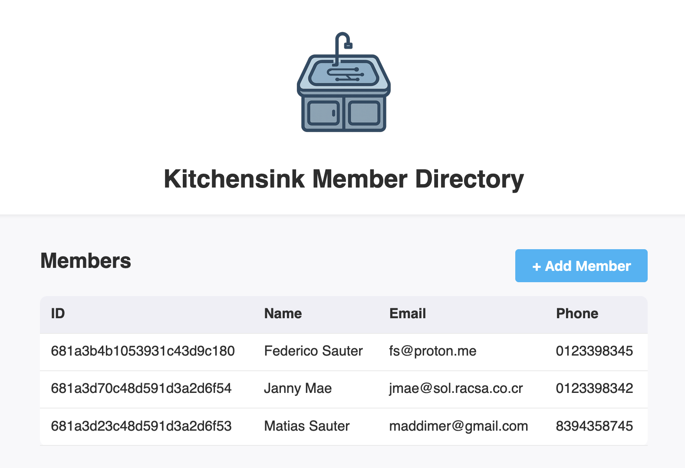

# Kitchensink Migration — Modernized Reference Application


[](https://github.com/federico-sauter/kitchensink-migration/actions/workflows/smoke-tests-matrix.yml)
[](https://github.com/federico-sauter/kitchensink-migration/actions/workflows/spring-app.yml)

A **side‑by‑side modernization** of the classic [JBoss/WildFly *kitchensink* demo](https://github.com/jboss-developer/jboss-eap-quickstarts/tree/8.0.x/kitchensink) to a **Spring Boot 3 stack backed by MongoDB 6**.  The repository contains:

| Module               | Purpose                                                                                                         |
| -------------------- | --------------------------------------------------------------------------------------------------------------- |
| `legacy/kitchensink` | Original Jakarta EE application (WAR) running on WildFly — kept intact for comparison & regression tests.       |
| `app/`               | Modern Spring Boot implementation (REST + Thymeleaf UI) with domain‑driven services and MongoDB persistence.    |
| `smoke‑tests/`       | Black‑box REST smoke‑suite shared by **both** targets to guarantee behavioural parity.                          |
| `.github/workflows/` | Unified CI pipeline that builds, containerises, and runs the smoke tests against **both** flavours in parallel. |

---

## Quick Start (Docker Compose)

> **Prerequisites**: Docker 28+ and Docker Compose v2.

```bash
# spin up MongoDB + Spring Boot
docker compose up --build

# UI — http://localhost:8081/kitchensink/ui/members
# API — http://localhost:8081/kitchensink/rest/members
# Health — http://localhost:8081/kitchensink/actuator/health
# Metrics — http://localhost:8081/kitchensink/actuator/metrics
# Mongo-Express — http://localhost:8082/
```

The compose file starts:

* **MongoDB 6** on `27017` (no auth for demo)
* **Mongo-Express** on `8082` (`admin:pass`)
* **Spring Boot** on `8081`

A one‑liner to tear down:

```bash
docker compose down -v   # removes containers & anonymous volumes
```

---

## Local Development (without Docker)

> **Prerequisites**: The Java 21 JDK is installed and `JAVA_HOME` points to your JDK installation directory.

```bash
cd app
./gradlew bootRun          # hot reload via spring‑dev‑tools
```

Spring looks for a local MongoDB at `mongodb://localhost:27017/kitchensink`; if you don’t have one:

```bash
docker run -d --name mongo -p 27017:27017 mongo:6
```

**Limitation:** The actuators are currently inoperative in the local development setup.

---

## REST API

| Verb   | Path                 | Description                                                                                                           |
| ------ | -------------------- | --------------------------------------------------------------------------------------------------------------------- |
| `GET`  | `/rest/members`      | List members ordered by name                                                                                          |
| `GET`  | `/rest/members/{id}` | Fetch single member                                                                                                   |
| `POST` | `/rest/members`      | Register new member — **200** empty body on success, **409** when e‑mail already exists, **400** on validation errors |

Validation rules are enforced using Jakarta Bean Validation (@NotNull, @Size, @Email, etc.).

---

## Web UI (Thymeleaf)

`GET /kitchensink/members` renders a minimalist table + modal registration form.  Vanilla JS fetches the REST endpoints; no build toolchain is required for the front‑end.



---

## Observability

* **Spring Boot Actuator** — `/kitchensink/actuator/health` and `/metrics` are exposed.

---

## Testing & CI

| Level           | Tech                           | Location                                              | Status |
| --------------- | ------------------------------ | ----------------------------------------------------- | -------| 
| **Spring Boot CI** | Maven | `app/` — Simple build test | [](https://github.com/federico-sauter/kitchensink-migration/actions/workflows/spring-app.yml) |
| **Smoke / E2E** | Maven + Rest‑Assured           | `smoke-tests/` — runs against real containers in CI   | [](https://github.com/federico-sauter/kitchensink-migration/actions/workflows/smoke-tests-matrix.yml) |


### GitHub Actions pipeline

```
🟢 Build -> 🏗️ Docker image  -> 🔬 Smoke tests (legacy & spring) -> ✅
```

Highlights:

* Matrix strategy runs **WildFly & Spring Boot** in parallel.
* Health‑probe loop (curl) waits for readiness.
* Fail‑fast timeout keeps minutes low.
* Cache‑less Docker build ensures reproducible artefacts.

---

## Architecture Notes

* **Migration Strategy**

  0. Create an vector DB idex of the legacy repo for RAG queries.
  1. *Strangle* the legacy by writing a drop‑in REST implementation.
  2. Run behaviour‑parity smoke suite to prove zero regression.
  3. Swap relational JPA for MongoDB without touching controllers.

* **Clean builds** — Java 21 tool‑chain via Gradle Wrapper; no local JDK leak.

* **Container first** — Multistage Dockerfile

---

## RAG Tools: Index & Query the Legacy Codebase

We use a lightweight Retrieval-Augmented Generation (RAG) system to query the legacy `kitchensink` Java codebase using natural language. This system includes two CLI tools described in the following sections.


### 1. `tools/index.py` — Chunk and Index the Code

This script:

* Recursively chunks `.java` files from `legacy/kitchensink/src` into overlapping text segments.
* Embeds them using OpenAI (`text-embedding-ada-002`).
* Stores the vectors using a persistent ChromaDB instance in `vector_store/`.

**Run once after code changes or to initialize the vector DB:**

```bash
OPENAI_API_KEY=sk-... tools/index.py
```

### 2. `tools/chat.py` — Ask Questions About the Code

This script:

* Lets you compose a question in your `$EDITOR` (e.g., `vi`).
* Embeds your query, retrieves the top 5 relevant chunks from the DB, and generates an answer via OpenAI (`gpt-4o-mini`).
* Saves all Q\&A pairs to `responses/` as markdown files.

**Start an interactive session:**

```bash
OPENAI_API_KEY=sk-... tools/chat.py
```

### Tool Setup Requirements:

Create and activate a Python venv:

```bash
python3 -m venv .venv && source .venv/bin/activate
pip install -r tools/requirements.txt
```

Make sure `OPENAI_API_KEY` is set in your environment!

---

## Maintainer

👤 **Federico Sauter**

> *Built with ❤️, an eye for backwards compatibility, and the mindset of “leave things better than you found them.”*
